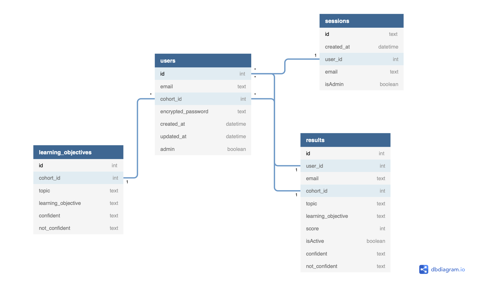

# KnowledgeChecklistBackend

## Welcome to Our Project!


## Table of Contents

- [Introduction](#introduction)
- [Technologies](#technologies)
- [Setup](#Setup)
- [User Authentication](#user-authentication)

  - [Creating a session ID](#creating-a-session-id)
  - [Find a current user’s ID](#find-a-current-users-id)
  - [Registering a user](#registering-a-user)
  - [Validating a user log-in](#validating-a-user-log-in)

- [Database Schema](#database-schema)
- [License](#license)
- [Developers](#developers)

## Introduction

## Technologies

This repository uses [deno](https://deno.land/manual/getting_started/installation) to run its files.
For our database we use [PostgreSQL](https://www.postgresql.org/) to store data.
To deploy the server, this repository is using.. ()

## Setup

There is another repository which is closely related and can be found [here](https://github.com/olliecase-green/KnowledgeChecklistFrontend). It is recommended that you create a folder and clone both the frontend and backend repos into the same folder.

Start by forking this backend repository, and then cloning the repository into your local drive. Toggle into the directory, /KnowledgeChecklistBackEnd, and run the following command into your terminal to initiate the backend server:

```
deno run --allow-net --allow-read --allow-write server.js
```

The frontend React application requires this backend server to be running to work correctly. Now, relevant requests will be made from the frontend React app using the fetch API.

## User Authentication

### Creating a session ID

A session is created when a registered user logs in to the app and is stored in the browser's cookies. This ensures the user remains logged in for the duration of their session.
A session ID is generated and then inserted into the users database as below.

```
  const sessionID = v4.generate();
  await db.query(`INSERT INTO sessions (id, user_id, email, created_at, isAdmin) VALUES (?, ?, ?, datetime('now'), ?)`, [
    sessionID,
    userID,
    e,
    isAdmin,
  ]);
```

The cookies are stored in the browser and are set to expire after 24 hours:

```
  const expiryDate = new Date();
  expiryDate.setDate(expiryDate.getDate() + 1);
  server.setCookie({
    name: "sessionId",
    value: sessionID,
    expires: expiryDate,
  });
  server.setCookie({ name: "userID", value: userID, expires: expiryDate });
  server.setCookie({ name: "email", value: e, expires: expiryDate });
  server.setCookie({ name: "isAdmin", value: isAdmin, expiryDate });
}
```

### Registering a user

A user is registered by taking the email, password and cohort ID supplied and then generating a salted password using bcrypt.

```
  const { email, password, cohort_id } = await server.body;
  const salt = await bcrypt.genSalt(8);
  const passwordEncrypted = await bcrypt.hash(password, salt);
```

To ensure there are no repeat emails, this is checked before allowing a sign up:

```
  const checkRepeatEmails = [...db.query("SELECT COUNT(*) FROM users WHERE email = ?", [email])];

  if (checkRepeatEmails[0][0]) {
    return server.json({ error: "Email already in use" }, 400);
  }
```

### Validating a user log-in

To validate a log in, firstly the users database is scanned to see if the user's email exists. The password supplied is then compared against the encrypted password stored in the database.

```
  const { email, password } = await server.body;
  const authenticated = [...db.query("SELECT * FROM users WHERE email = ?", [email]).asObjects()];
  if (authenticated.length && (await bcrypt.compare(password, authenticated[0].encrypted_password))) {
    makeSession(authenticated[0].id, authenticated[0].email, server, authenticated[0].admin);
    server.json({ success: true });
  } else {
    server.json({ success: false });
  }
}
```

If the conditions are satisfied, a session is generated as above.

## Database Schema

An image of our database schema and how are tables are connected can be seen below.



## Backend functionality

### Retrieving cohorts, learning objectives and student emails

There are a number of endpoints which can be used to retrieve information from the database. For example, the code below fetches the learning objectives for a specific cohort, which can be viewed by the admin.

```
  const { cohort_id } = await server.params;
  const query = `
    SELECT *
    FROM learning_objectives
    WHERE cohort_id = ?
    ORDER BY topic ASC
  `;
  const cohortLOs = [...(await db.query(query, [cohort_id]).asObjects())];
  return server.json(cohortLOs);
```

### Posting learning objectives and cohorts

A learning objective can be posted for a specific cohort using the following endpoint:

```
  const { cohort_id, topic, learning_objective, notConfident, confident } = await server.body;
  if (confident.length > 0) {
    if (!(await checkValidUrl(confident))) {
      return server.json({ error: "Invalid URL" }, 400);
    }
    if (!(await checkValidUrl(notConfident))) {
      return server.json({ error: "Invalid URL" }, 400);
    }
  }
```

There is an option to insert a 'confident' and 'not confident' resource. If entered, these resources are checked as valid URLs.

```
  const query = `
    INSERT INTO learning_objectives(cohort_id, topic, learning_objective,not_confident,confident)
    VALUES (?, ?, ?, ? , ?)
  `;
  db.query(query, [cohort_id, topic, learning_objective, notConfident, confident]);
```

Next, the learning objective is inserted into the database using the cohort ID supplied. It will then appear for all students on that cohort.

A cohort can also be added, will will include default learning objectives. The next number up from the previous cohort ID will be added:

```
  const { cohort_id } = await server.body;
  const data = [
    ["HTML/CSS", "Understand what parent and child is"],
    ["HTML/CSS", "Can create and link a stylesheet"],
    ["Javascript", "Be able to link a Javascript file in your project"],
    ["Javascript", "Be able to do a console.log()"],
    ["React", "Understand the difference between class and functional components"],
    ["React", "Be able to create a React application with create-react-app"],
  ];
  data.forEach((item) => {
    db.query(
      `
      INSERT INTO learning_objectives (cohort_id, topic, learning_objective)
      VALUES (?, '${item[0]}', '${item[1]}')
    `,
      [cohort_id]
    );
  });
```

## License

The license for this project can be found [here](license.md)

The Developers that worked on this project are:

Project Manager & Engineer: [Fahmidul Haque](https://github.com/FahmidulHaquee)
System Architect & Engineer: [Oliver-case Green](https://github.com/olliecase-green)
Quality Assurance & Engineer: [Zayn Shah](https://github.com/zaynshah)
